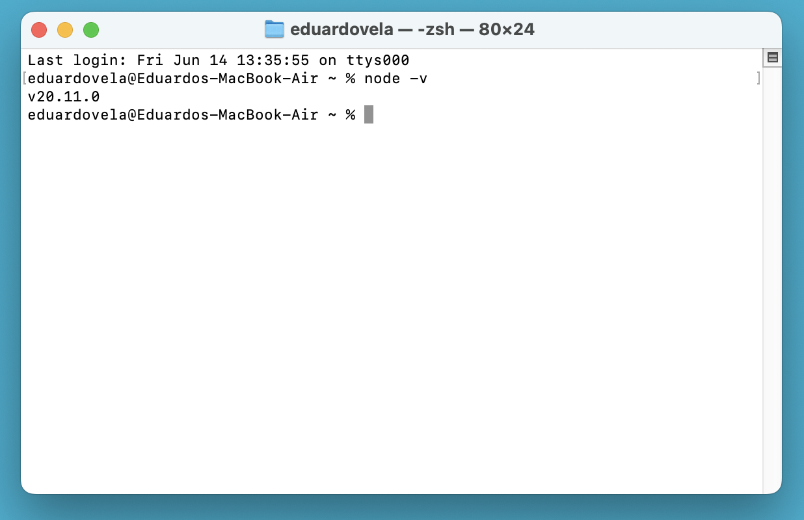
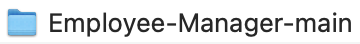
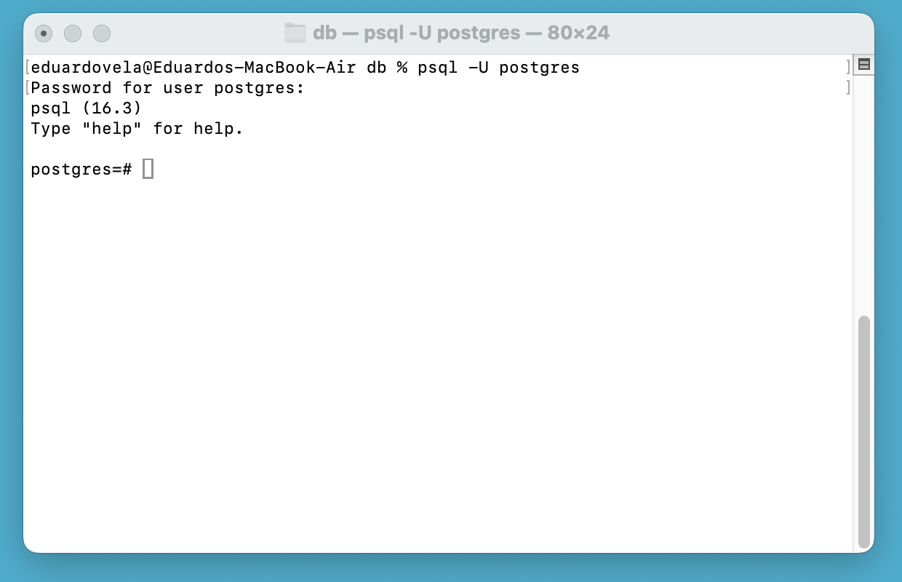
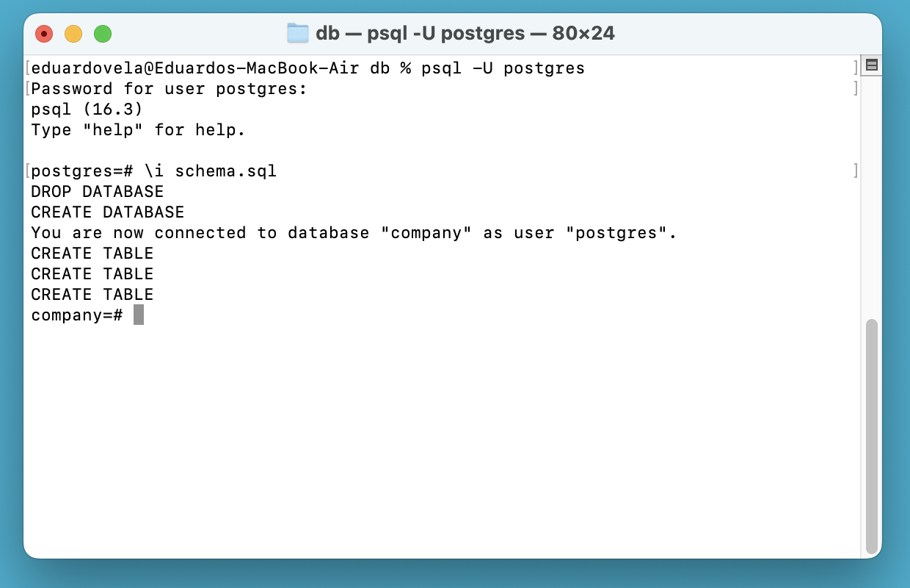
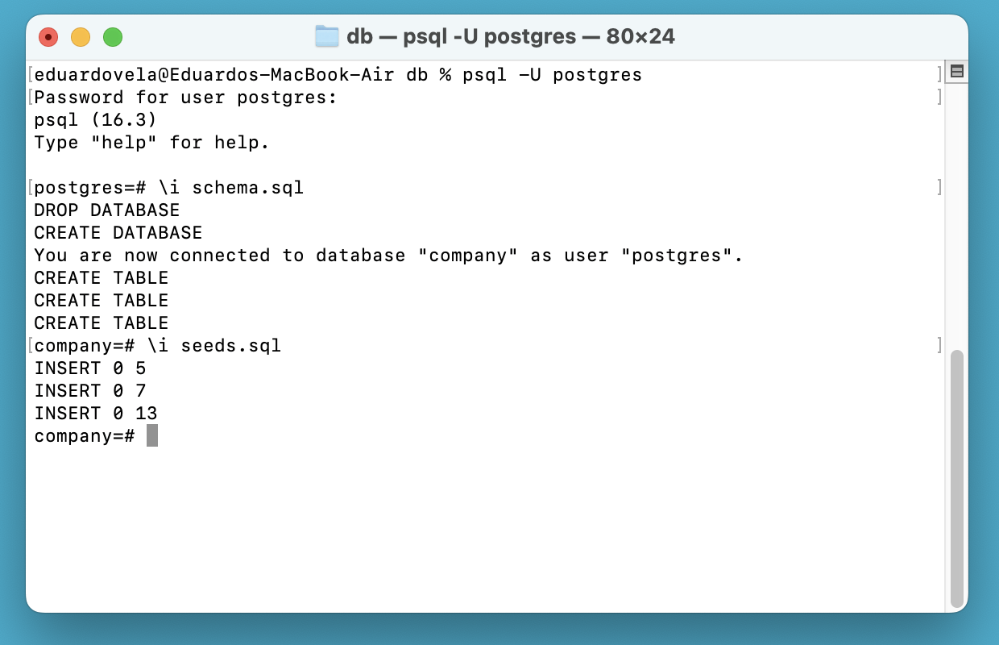
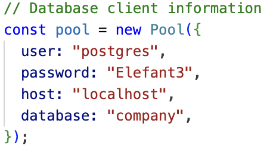
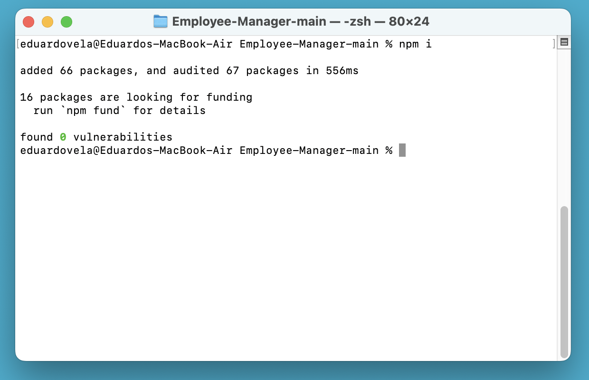
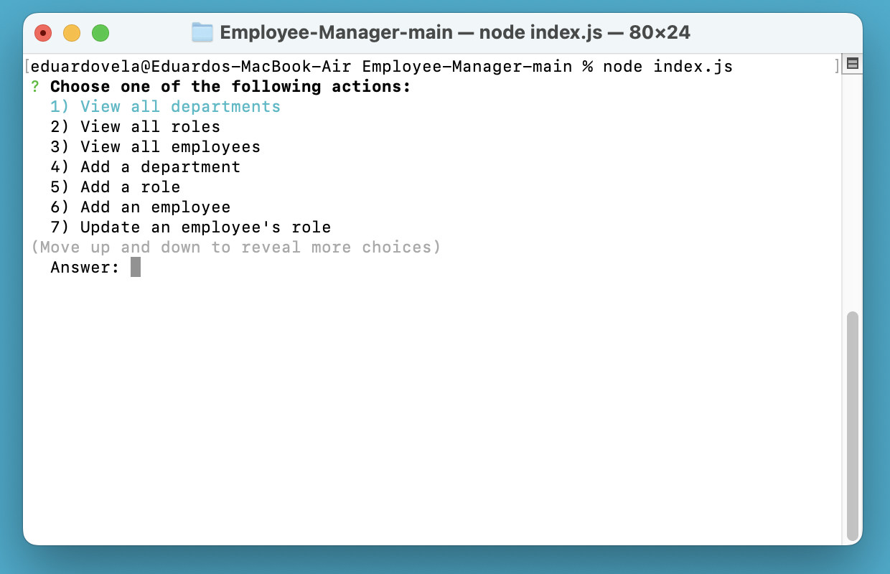

# Employee Manager

## Description

Employee manager is a simple console application that allows you to keep track of your employees, since it allows you to store the departments, roles, and employees of your company. The main reason I created this project was to learn how to use a Postgres database, and to learn how to connect it to a project. I learned that databases offer a more safe and reliable way to store information, than storing information on text files or JSON files. Databases also allow you to connect data elements with each other, by using primary and foreign keys, which allow you to store data in a more efficient manner and avoid redundant data by using normal forms.

## Table of Contents

- [Installation](#installation)
- [Usage](#usage)
- [Credits](#credits)
- [License](#license)

## Installation

1. First check if you have downloaded and installed Node.js in your computer system. To check if you have Node.js installed or not, run the “node -v” command on a terminal or console, and if it is installed it should return the version of Node.js that was installed in your system. If you didn’t see the version of Node.js, it means you don’t have downloaded and installed it yet. To do that, click on the following link to download the installer: https://nodejs.org/en/download/prebuilt-installer

2. Also you need to download and install PostgreSQL in your system. To do that click on the following link to download the installer, then follow the installer’s directions until the setup is complete: https://www.postgresql.org/download/

3. Now that you have Node.js and PostgreSQL installed in your computer system, you can now download Employee manager. To do that, click on the green “Code” button found on the main branch of the GitHub repository. Then choose the “Download ZIP” option, to download the Employee Manager’s code as a .zip file. Then you just need to decompress the downloaded .zip file to extract the Employee Manager’s code found inside it.

4. Once you have extracted the Employee Manager’s code from the downloaded file, you need to use a terminal or console to navigate to its “db” folder’s location. Once you are at the "db" folder’s location execute the “psql -U [YOUR USERNAME]“ with the username you created in the PostgreSQL installer, and login with the password you created in the PostgreSQL installer as well. Then run the “\i schema.sql” command, to create the tables that Employee Manager needs to function, and optionally the “\i seeds.sql” command if you want to populate the database with sample data.

5. After that is done, open the “pool.js” file, which is found by first accessing the “assets” folder, then the “js” folder, and finally the “queries” folder. Then replace the user, password, and host attributes of the "pool" object, with the ones you created with PostgreSQL installer.

6. Then open another terminal or console in the Employee Manager’s folder location and run the “npm i” command, to install the node modules Employee Manager uses. Then run the “node index.js” command to start using Employee Manager.

## Usage

To use Employee Manager, check out the following walkthrough video: https://drive.google.com/file/d/1tgzuKTb-eU9yzQEBI9EiSUqIXtigpwNi/view?usp=sharing

## Credits

- To learn how to use the “pg” npm package:

  - Carlson, B. (n.d.-b). new Pool. Pg.pool – node-postgres. https://node-postgres.com/apis/pool
  - Carlson, B. (n.d.-a). new Client. Pg.client – node-postgres. https://node-postgres.com/apis/client

- To learn how to use the “inquirer” npm package:
  - npm. (n.d.). Inquirer.js. Inquirer - npm. https://www.npmjs.com/package/inquirer

## License

Employee Manager is under the MIT license.
